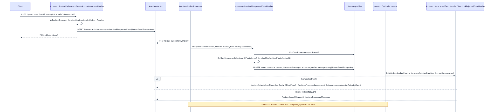
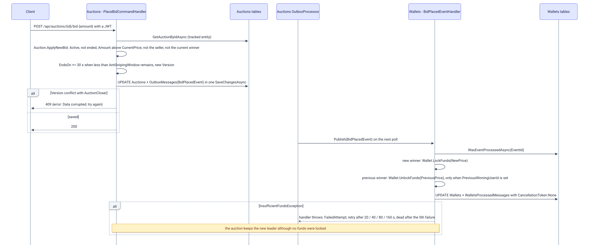
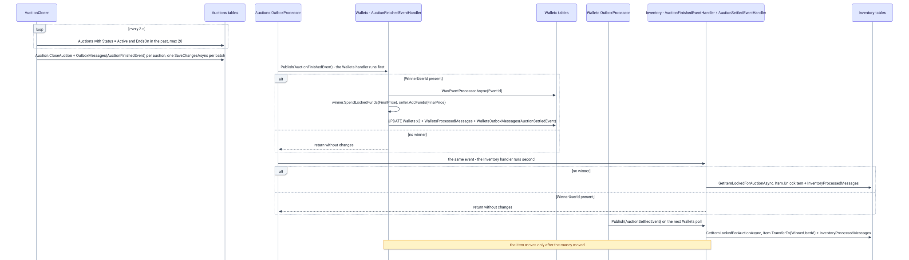

# AuctionServer — architecture

> English version. Polish 1:1 counterpart: [../pl/ARCHITECTURE.md](../pl/ARCHITECTURE.md)

AuctionServer is a .NET 10 modular monolith for a gamified auction house: four modules (Identity, Wallets, Auctions, Inventory) run in one ASP.NET Core process, share one PostgreSQL database and talk to each other only through integration events carried by a transactional outbox and consumed through an inbox. This page covers the system context, the module layering, request handling, cross-module messaging, the three auction flows, the data model, the CI pipeline, the design patterns in use and the known limitations. Module-level detail lives in the [backend chapters](backend/README.md).

## System context

The diagram shows the single process that exists today, the PostgreSQL database behind it and, with dashed borders, the parts that are planned but not yet in the repository.

<picture>
  <source media="(prefers-color-scheme: dark)" srcset="../diagrams/architecture-01-system-context.dark.svg">
  
</picture>

Today the whole system is one ASP.NET Core host, [`AuctionServer.Api`](../../Backend/src/AuctionServer.Api/Program.cs), listening on `http://localhost:5244` in development ([`launchSettings.json`](../../Backend/src/AuctionServer.Api/Properties/launchSettings.json)). Clients call minimal-API endpoints with JSON; the repository contains no frontend, no gateway, no message broker and no bot code. The planned target, described in the deleted `AGENTS.md` and in the previous README, puts an Angular frontend and Python AI bots behind an API gateway and moves integration events to RabbitMQ; the `IIntegrationEventPublisher` seam is the place where that transport would plug in.

| Component | Status | Documented in |
|---|---|---|
| `AuctionServer.Api` host with the four modules | exists | [backend/README.md](backend/README.md) |
| PostgreSQL, one database, 11 tables | exists (started by hand or by Testcontainers) | [Data model](#data-model) |
| GitLab CI pipeline | exists | [Build and CI](#build-and-ci) |
| Angular frontend | planned | [frontend.md](frontend.md) |
| API gateway, RabbitMQ, Docker Compose | planned | [infrastructure.md](infrastructure.md) |
| AI bots (Python) | planned | [bots.md](bots.md) |

## Modules and layering

The diagram shows the project references: the host references the four modules, every module references only `AuctionServer.Shared.Integration`, and no module references another module.

<picture>
  <source media="(prefers-color-scheme: dark)" srcset="../diagrams/architecture-02-module-layering.dark.svg">
  
</picture>

Each module is one `.csproj` split into `Presentation/` (minimal-API endpoints and request records), `Application/` (MediatR commands, queries and validators, event handlers, repository interfaces), `Domain/` (entities, enums, exceptions) and `Infrastructure/` (DbContext, repositories, EF configurations, outbox, inbox, background services, migrations). The module project files declare a single `ProjectReference`, to [`AuctionServer.Shared.Integration`](../../Backend/src/AuctionServer.Shared.Integration/AuctionServer.Shared.Integration.csproj), which holds the nine event records, `AppException`, `IIntegrationEventPublisher`, `IntegrationEventTypes` and `ValidationBehaviour`. The host wires a module with one extension method per module (`AddAuctionModule`, `AddWalletsModule`, `AddIdentityModule`, `AddInventoryModule`) and maps its endpoints with `Map*Endpoints`; both calls sit in [`Program.cs`](../../Backend/src/AuctionServer.Api/Program.cs).

| Module | Route prefix | DbContext | Tables | Background services | Tests |
|---|---|---|---|---|---|
| [Identity](backend/identity.md) | `/api/users` | `IdentityDbContext` | `Users`, `IdentityOutboxMessages` | `OutboxProcessor` | `AuctionServer.Modules.Identity.Tests` |
| [Wallets](backend/wallets.md) | `/api/wallets` | `WalletDbContext` | `Wallets`, `WalletsOutboxMessages`, `WalletsProcessedMessages` | `OutboxProcessor` | `AuctionServer.Modules.Wallets.Tests` |
| [Auctions](backend/auctions.md) | `/api/auctions` | `AuctionDbContext` | `Auctions`, `OutboxMessages`, `AuctionsProcessedMessages` | `OutboxProcessor`, `AuctionCloser` | `AuctionServer.Modules.Auctions.Tests` |
| [Inventory](backend/inventory.md) | `/api/inventory` | `InventoryDbContext` | `InventoryItems`, `InventoryOutboxMessages`, `InventoryProcessedMessages` | `OutboxProcessor` | `AuctionServer.Modules.Inventory.Tests` |

The module rules are enforced by convention, not by tooling: no cross-module project reference, no cross-module database query, and `Domain/` and `Application/` free of ASP.NET Core types. The last rule holds for ASP.NET Core itself, but `Application/` handlers do reference their own module's `Infrastructure.Outbox` and `Infrastructure.Inbox` types to build outbox and inbox rows, and `LoginCommandHandler` reads `IConfiguration` directly.

## Request handling

Every request passes through three middlewares registered in [`Program.cs`](../../Backend/src/AuctionServer.Api/Program.cs): `UseExceptionHandler` (backed by [`GlobalExceptionHandler`](../../Backend/src/AuctionServer.Api/Infrastructure/GlobalExceptionHandler.cs)), `UseAuthentication` and `UseAuthorization`. Endpoints read the caller's id from the `ClaimTypes.NameIdentifier` claim, build a MediatR command or query and call `ISender.Send`; they contain no business logic and no try/catch. The request pipeline diagram and the authentication details are in [backend/README.md](backend/README.md).

- **Validation.** [`ValidationBehaviour<,>`](../../Backend/src/AuctionServer.Shared.Integration/Validators/ValidationBehaviour.cs) is registered as a MediatR open behavior for every module assembly; it runs all FluentValidation validators of the request and throws `RequestValidationException` (400) with the messages joined by `; `.
- **Errors.** `AppException` carries its own HTTP status, so the handler returns that status with `{ "error": "<message>" }`; `DbUpdateConcurrencyException` becomes 409 `Data corrupted, try again`; anything else is logged and returned as 500 `Unhandled error occurred`.
- **Authentication.** JWT bearer is the default scheme; a second scheme named `ApiKey` reads the `X-Api-Key` header. Two policies exist: `Bot` (`RequireRole("Bot")`) and `BotProvisioning` (the `ApiKey` scheme plus an authenticated user).
- **JSON.** The host keeps the ASP.NET Core web defaults, so response property names are camelCase (`publicAuctionId`, `error`) and request bodies are matched without regard to case; enums are serialized as strings (`JsonStringEnumConverter`), so `Status` and `Rarity` values appear by name.

## Cross-module communication

Modules never call each other. A module that needs another module to react writes an integration event into its own outbox table in the same `SaveChangesAsync` as the state change; a background poller publishes it later, and the consuming module records the event id in its inbox table so that a redelivery changes nothing. The mechanics, the outbox columns and the retry policy are described in [backend/messaging.md](backend/messaging.md); the path of one event is:

1. The producer adds an `OutboxMessage` row (`Id` equal to the event's `EventId`, `Type` equal to the event class name, `Content` with the JSON payload) to the same transaction as its entity change.
2. The module's `OutboxProcessor` (a `BackgroundService`, one copy per module) polls every 3 s for up to 20 rows that are unprocessed, not dead and due, ordered by `CreatedOn`.
3. It calls [`IIntegrationEventPublisher.PublishAsync`](../../Backend/src/AuctionServer.Shared.Integration/Messaging/IIntegrationEventPublisher.cs); the only implementation, [`InProcessEventPublisher`](../../Backend/src/AuctionServer.Api/Infrastructure/Messaging/InProcessEventPublisher.cs), deserializes the payload through [`IntegrationEventTypes`](../../Backend/src/AuctionServer.Shared.Integration/Messaging/IntegrationEventTypes.cs) and publishes it with MediatR `IPublisher`.
4. MediatR runs the matching `INotificationHandler`s one after another, in the order the module assemblies are registered in `Program.cs` (Auctions, Wallets, Identity, Inventory).
5. A consumer first asks `WasEventProcessedAsync(EventId)`, then applies the domain change and saves it together with a `ProcessedMessage` row (and a reply outbox row, when it replies) in one `SaveChangesAsync`; a primary-key violation on the inbox row surfaces as `EventAlreadyProcessedException`, which the handler swallows.
6. Any other exception propagates back to the `OutboxProcessor`, which records it on the row and schedules a retry; after the fifth failure the row is marked dead.

| Event | Payload (besides `EventId`) | Producer | Consumers | Inbox |
|---|---|---|---|---|
| `UserRegisteredEvent` | `PublicUserId`, `Email` | Identity `RegisterCommandHandler`, `RegisterBotCommandHandler` | Wallets `UserRegisteredEventHandler` | no; a duplicate hits the wallet primary key and `WalletAlreadyExistException` is swallowed |
| `ItemLockRequestedEvent` | `PublicAuctionId`, `PublicItemId`, `SellerUserId` | Auctions `CreateAuctionCommandHandler` | Inventory `ItemLockRequestedEventHandler` | yes |
| `ItemLockedEvent` | `PublicAuctionId`, `PublicItemId`, `ItemName`, `ItemRarity`, `OfficialPrice` | Inventory `ItemLockRequestedEventHandler` | Auctions `ItemLockedEventHandler` | yes |
| `ItemLockRejectedEvent` | `PublicAuctionId`, `PublicItemId`, `Reason` | Inventory `ItemLockRequestedEventHandler` | Auctions `ItemLockRejectedEventHandler` | yes |
| `AuctionActivatedEvent` | auction and seller ids, item snapshot, `CurrentPrice`, `EndsOn` | Auctions `ItemLockedEventHandler` | none | — |
| `BidPlacedEvent` | `PublicAuctionId`, `NewWinningUserId`, `PreviousWinningUserId?`, `NewPrice`, `PreviousPrice?` | Auctions `PlaceBidCommandHandler` | Wallets `BidPlacedEventHandler` | yes |
| `AuctionFinishedEvent` | `PublicAuctionId`, `SellerUserId`, `WinnerUserId?`, `FinalPrice?` | Auctions `AuctionCloser` | Wallets `AuctionFinishedEventHandler`, Inventory `AuctionFinishedEventHandler` | yes, in both |
| `AuctionSettledEvent` | `PublicAuctionId`, `SellerUserId`, `WinnerUserId`, `FinalPrice` | Wallets `AuctionFinishedEventHandler` | Inventory `AuctionSettledEventHandler` | yes |
| `ItemSoldToShopEvent` | `PublicItemId`, `OwnerUserId`, `Price` | Inventory `SellItemToShopCommandHandler` | Wallets `ItemSoldToShopEventHandler` | yes |

The records live in [`Shared.Integration/Events/`](../../Backend/src/AuctionServer.Shared.Integration/Events) and the handlers in each module's `Application/Handlers/` folder. Adding an event means adding a record and registering it in `IntegrationEventTypes`; an unregistered type makes `Deserialize` throw `NotSupportedException`, so the outbox row fails and eventually dead-letters.

## Auction flows

### Creating an auction (item-lock saga)

The sequence below shows how a new auction is stored as `Pending`, how Inventory locks the item and how Auctions activates or cancels the auction when the reply arrives.

<picture>
  <source media="(prefers-color-scheme: dark)" srcset="../diagrams/architecture-03-auction-creation-saga.dark.svg">
  
</picture>

1. The client calls `POST /api/auctions` with `{ itemId, startingPrice, endsOn }` and a JWT; [`AuctionEndpoints`](../../Backend/src/AuctionServer.Modules.Auctions/Presentation/AuctionEndpoints.cs) takes the seller id from the token and sends `CreateAuctionCommand`.
2. `CreateAuctionCommandValidator` requires a positive `StartingPrice` and an `EndsOn` between now and 30 days ahead; `Auction.Create` additionally requires `EndsOn` at least one minute in the future and creates the auction with `Status = Pending` and `CurrentPrice = StartingPrice` ([`Auction.cs`](../../Backend/src/AuctionServer.Modules.Auctions/Domain/Entities/Auction.cs)).
3. [`AuctionRepository.CreateAuctionAsync`](../../Backend/src/AuctionServer.Modules.Auctions/Infrastructure/Persistence/AuctionRepository.cs) inserts the `Auctions` row and an `OutboxMessages` row carrying `ItemLockRequestedEvent` in one `SaveChangesAsync`; a unique violation on the filtered `ItemId` index (one open auction per item) becomes `AuctionAlreadyExistException` (409).
4. The endpoint returns `201 Created` with `{ publicAuctionId }` before Inventory has seen the request.
5. The Auctions `OutboxProcessor` publishes the event; Inventory's [`ItemLockRequestedEventHandler`](../../Backend/src/AuctionServer.Modules.Inventory/Application/Handlers/ItemLockRequestedEventHandler.cs) checks its inbox, loads the item with `GetUserItemAsync(SellerUserId, PublicItemId)` and calls `Item.LockForAuction(PublicAuctionId)`. It replies with `ItemLockedEvent` (name, rarity, official price) or, when the item does not belong to the seller (`UserOrItemDoesntExistException`) or is not `Available` (`ItemNotAvailableException`), with `ItemLockRejectedEvent` carrying the exception message as `Reason`; the item update, the inbox row and the reply are one `SaveChangesAsync`.
6. The Inventory `OutboxProcessor` publishes the reply; [`ItemLockedEventHandler`](../../Backend/src/AuctionServer.Modules.Auctions/Application/Handlers/ItemLockedEventHandler.cs) calls `Auction.Activate(itemName, itemRarity, officialPrice)`, which copies the item snapshot onto the auction and switches it to `Active`, and writes `AuctionActivatedEvent` to the outbox; [`ItemLockRejectedEventHandler`](../../Backend/src/AuctionServer.Modules.Auctions/Application/Handlers/ItemLockRejectedEventHandler.cs) calls `Auction.Cancel(reason)`.
7. While the auction is `Pending`, a bid fails with 400 `Auction is not active, current status: Pending`; `GET /api/auctions` lists only `Active` auctions, and `GET /api/auctions/{id}` returns any status together with `CancellationReason`.
8. `AuctionActivatedEvent` is registered and published, but no module handles it.

### Bidding and locking funds

The sequence below shows a bid being accepted synchronously and the bidder's funds being locked afterwards by Wallets.

<picture>
  <source media="(prefers-color-scheme: dark)" srcset="../diagrams/architecture-04-bid-and-funds-lock.dark.svg">
  
</picture>

1. The client calls `POST /api/auctions/{id}/bid` with `{ amount }`; `PlaceBidCommandValidator` only requires non-empty ids and a positive amount.
2. [`PlaceBidCommandHandler`](../../Backend/src/AuctionServer.Modules.Auctions/Application/Commands/PlaceBid/PlaceBidCommandHandler.cs) loads the tracked auction (404 `AuctionNotFoundException` when missing), remembers the previous price and winner and calls `Auction.ApplyNewBid`, which checks in this order: not `Pending` (400 `AuctionNotActiveException`), `Active` and not past `EndsOn` (400 `AuctionClosedException`), amount above `CurrentPrice` (400 `InvalidBidException`), bidder is not the seller (400 `CannotBidOwnItemException`), bidder is not already the winner (400 `AlreadyHighestBidderException`).
3. The auction stores the new winner and price; when less than `AntiSnipingWindow` (30 s) remains, `EndsOn` is extended by 30 s; `Version` is regenerated.
4. `SaveChangesWithOutboxAsync` writes the auction update and a `BidPlacedEvent` row in one transaction. `Version` is a concurrency token, so a concurrent close or bid makes EF Core throw `DbUpdateConcurrencyException`, which the client sees as 409 `Data corrupted, try again`.
5. The endpoint returns 200 with an empty body.
6. Wallets' [`BidPlacedEventHandler`](../../Backend/src/AuctionServer.Modules.Wallets/Application/Handlers/BidPlacedEventHandler.cs) checks its inbox, locks `NewPrice` on the new winner's wallet (`Wallet.LockFunds`, 400 `InsufficientFundsException` when `AvailableFunds` is too low) and, only when both `PreviousWinningUserId` and `PreviousPrice` are set, unlocks `PreviousPrice` on the previous winner's wallet; the save uses `CancellationToken.None`.
7. If `LockFunds` throws, the exception reaches the Auctions `OutboxProcessor`, the row is retried with backoff and finally dead-lettered, while the auction keeps the new leader and the previous winner's funds stay locked; the designed fix (a pessimistic bid confirmed by Wallets before it leads) is listed in [VISION.md](VISION.md).

### Closing and settlement

The sequence below shows the background closer ending an auction and the settlement chain that pays the seller and transfers the item.

<picture>
  <source media="(prefers-color-scheme: dark)" srcset="../diagrams/architecture-05-close-and-settlement.dark.svg">
  
</picture>

1. [`AuctionCloser`](../../Backend/src/AuctionServer.Modules.Auctions/Infrastructure/Background/AuctionCloser.cs) runs every 3 s, loads up to 20 auctions with `Status = Active` and `EndsOn` in the past, calls `CloseAuction()` on each and adds an `AuctionFinishedEvent` row (`WinnerUserId` from `CurrentWinningUserId`, `FinalPrice` from `CurrentPrice`, both null without a bid); the batch is saved in one `SaveChangesAsync`, and a failure (for example a `Version` conflict with a bid) fails the whole cycle, is logged as `Auction closing cycle failed` and is retried on the next tick.
2. The Auctions `OutboxProcessor` publishes the event; because of the registration order the Wallets handler runs before the Inventory handler.
3. Wallets' [`AuctionFinishedEventHandler`](../../Backend/src/AuctionServer.Modules.Wallets/Application/Handlers/AuctionFinishedEventHandler.cs) returns immediately without a winner; otherwise it checks the inbox, calls `winner.SpendLockedFunds(FinalPrice)` (400 `InsufficientLockedFundsException` when the funds were never locked) and `seller.AddFunds(FinalPrice)`, and saves both wallets, the inbox row and an `AuctionSettledEvent` outbox row in one `SaveChangesAsync`.
4. Inventory's [`AuctionFinishedEventHandler`](../../Backend/src/AuctionServer.Modules.Inventory/Application/Handlers/AuctionFinishedEventHandler.cs) acts only without a winner: it finds the item by `LockedForAuctionId` and calls `Item.UnlockItem()`, which returns the item to `Available`.
5. The Wallets `OutboxProcessor` publishes `AuctionSettledEvent`; Inventory's [`AuctionSettledEventHandler`](../../Backend/src/AuctionServer.Modules.Inventory/Application/Handlers/AuctionSettledEventHandler.cs) finds the locked item and calls `Item.TransferTo(WinnerUserId)`, which changes the owner, clears the lock and sets `Available`.
6. The 404 and 409 exceptions inside these handlers are deliberately not caught: the message is retried and, after five failures, parked as dead with its error history instead of being skipped silently.

## Data model

The diagram shows the eleven tables grouped by owning module; the prefix in each entity name is the module, and every relationship is dotted because no foreign key crosses a module boundary.

<picture>
  <source media="(prefers-color-scheme: dark)" srcset="../diagrams/architecture-06-data-model.dark.svg">
  
</picture>

All four `DbContext`s point at the same database and share the default `__EFMigrationsHistory` table (no context overrides the history table), so isolation rests on discipline and on distinct table names. Identifiers cross module boundaries as copied Guids: `Wallets.UserId` and `Auctions.SellerUserId` hold `Users.PublicUserId`, `Auctions.ItemId` holds `InventoryItems.PublicItemId`, and `InventoryItems.LockedForAuctionId` holds `Auctions.PublicAuctionId`. Column types come from the EF model snapshots in each module's migrations folder.

| Table | Module | Purpose |
|---|---|---|
| `Users` | Identity | accounts; unique `Email`, soft delete through a global query filter on `IsDeleted`, `UserRoles` stored as an integer |
| `IdentityOutboxMessages` | Identity | outbox for `UserRegisteredEvent` |
| `Wallets` | Wallets | one row per user keyed by `PublicUserId`; `AvailableFunds`, `LockedFunds`, `Version` |
| `WalletsOutboxMessages`, `WalletsProcessedMessages` | Wallets | outbox for `AuctionSettledEvent`, inbox |
| `Auctions` | Auctions | auctions with the item snapshot; unique `PublicAuctionId`, unique `ItemId` while `Status IN (0, 1)`, `Version` |
| `OutboxMessages` | Auctions | outbox; the only table without a module prefix |
| `AuctionsProcessedMessages` | Auctions | inbox |
| `InventoryItems` | Inventory | items; unique `PublicItemId`, unique nullable `LockedForAuctionId`, `Version` |
| `InventoryOutboxMessages`, `InventoryProcessedMessages` | Inventory | outbox, inbox |

Every outbox table has the same nine columns (`Id`, `Type`, `Content`, `CreatedOn`, `ProcessedOn`, `AttemptCount`, `Errors`, `IsDead`, `NextAttemptOn`) and every inbox table has `EventId` and `ProcessedOn`; see [backend/messaging.md](backend/messaging.md).

## Build and CI

The diagram shows the GitLab pipeline defined in [`.gitlab-ci.yml`](../../.gitlab-ci.yml).

<picture>
  <source media="(prefers-color-scheme: dark)" srcset="../diagrams/architecture-07-ci-pipeline.dark.svg">
  
</picture>

- Every job runs in the `mcr.microsoft.com/dotnet/sdk:10.0` image with a `docker:dind` service; `DOCKER_HOST=tcp://docker:2375` and `TESTCONTAINERS_HOST_OVERRIDE=docker` let Testcontainers start PostgreSQL inside the runner.
- Stage `build` runs `dotnet build Backend/AuctionServer.slnx`.
- Stage `test` has two jobs: `unit-tests` runs `AuctionServer.Modules.Auctions.Tests` with `--filter "FullyQualifiedName!~IntegrationTests"`, and `integration-tests` runs the Auctions integration tests followed by the whole Wallets, Identity and Inventory test projects.
- There is no deploy stage, no artifacts, no caching and no image of the application; the repository has no Dockerfile and no Compose file.

## Design patterns in use

- **Modular monolith.** One deployable, four modules with private tables and private `DbContext`s, a single shared contracts project.
- **CQRS in Auctions, CQS elsewhere.** Auctions writes through EF Core and reads through Dapper over `ISqlConnectionFactory` ([`GetActiveAuctionsQueryHandler`](../../Backend/src/AuctionServer.Modules.Auctions/Application/Queries/GetActiveAuctions/GetActiveAuctionsQueryHandler.cs)); Wallets and Inventory read through EF Core with `AsNoTracking`.
- **Transactional outbox.** Four copies of `OutboxMessage` and `OutboxProcessor`, one per module; the event row commits with the state change.
- **Inbox (idempotent consumer).** `ProcessedMessages` tables in Wallets, Auctions and Inventory, checked before the change and inserted with it.
- **Saga by choreography.** Auction creation and settlement are chains of events across modules with no orchestrator; each hop is a local transaction.
- **Optimistic concurrency.** `Version` is a Guid concurrency token on `Auction`, `Wallet` and `Item`, regenerated inside every mutating method; conflicts surface as 409 or as a retried background cycle.
- **Global error contract.** Domain exceptions derive from `AppException(message, statusCode)` and are mapped by one `IExceptionHandler`.
- **Validation pipeline.** FluentValidation validators next to their commands, executed by a MediatR behavior.
- **Filtered unique indexes.** One open auction per item (`"Status" IN (0, 1)`) and one item per auction lock (`LockedForAuctionId`, nulls distinct); Wallets also declares a unique index on `UserId` filtered on `"IsSuspendedWallet" = false`, which adds no constraint because `UserId` is already the primary key.
- **Surrogate key plus public id.** `AuctionId`/`PublicAuctionId`, `Id`/`PublicUserId`, `Id`/`PublicItemId`; only the Guids leave the module.
- **Composition by extension methods.** `Add<Module>Module` and `Map<Module>Endpoints` are the only entry points the host knows.
- **Polling background services.** `OutboxProcessor` (four copies) and `AuctionCloser` are `BackgroundService`s with a fixed 3 s delay between cycles.

## Known limitations

1. The Auctions outbox table is named `OutboxMessages` without a module prefix; the other three outbox tables are prefixed ([`AuctionDbContext`](../../Backend/src/AuctionServer.Modules.Auctions/Infrastructure/Persistence/AuctionDbContext.cs) has no `ToTable` for it).
2. `GET /api/wallets/{id}` is anonymous, so any caller can read any wallet's balances by user id ([`WalletEndpoints`](../../Backend/src/AuctionServer.Modules.Wallets/Presentation/WalletEndpoints.cs)).
3. A bid is accepted, and the auction's leader and price updated, before the bidder's funds are verified; an `InsufficientFundsException` in `BidPlacedEventHandler` dead-letters the event while the auction keeps the leader, and settlement later fails for the same reason.
4. The host has no CORS policy, no OpenAPI endpoint (the `Microsoft.AspNetCore.OpenApi` package is referenced but `AddOpenApi`/`MapOpenApi` are never called), no health checks and no migrations at startup.
5. No automated test crosses a module boundary; event handlers are tested by direct invocation. The two `WebApplicationFactory` fixtures ([`CustomAPI`](../../Backend/tests/AuctionServer.Modules.Wallets.Tests/IntegrationTests/CustomAPI.cs) in Wallets, `CustomApi` in Identity) migrate only their own module's context, so the other `OutboxProcessor`s and `AuctionCloser` log an error every 3 s during those tests.
6. `Role.Admin` is defined in [`Role.cs`](../../Backend/src/AuctionServer.Modules.Identity/Domain/Entities/Role.cs) but never assigned or checked.
7. [`Backend/.env.example`](../../Backend/.env.example) (`DB_USER`, `DB_PASSWORD`) has no reader; configuration comes from user secrets or `__` environment variables.
8. Auctions migrations live in two folders ([`Migrations/`](../../Backend/src/AuctionServer.Modules.Auctions/Migrations) with the initial migration and the snapshot, [`Infrastructure/Migrations/`](../../Backend/src/AuctionServer.Modules.Auctions/Infrastructure/Migrations) with the later ones), so `dotnet ef migrations add` must pass `--output-dir Infrastructure/Migrations`.
9. `Microsoft.Extensions.Hosting` is pinned to `11.0.0-preview.5.26302.115` in all four module projects while the rest of the stack is 10.0.x.
10. A `Pending` auction has no timeout: when its lock request dead-letters, the auction stays `Pending` forever, because `AuctionCloser` closes only `Active` auctions.
11. `AuctionActivatedEvent` is produced and registered but has no handler.
12. `Jwt:Key` and `Bots:ApiKey` are not validated at startup. Without `Jwt:Key` the bearer options cannot be built ([`Program.cs`](../../Backend/src/AuctionServer.Api/Program.cs)), so every request, anonymous ones included, answers 500 `Unhandled error occurred`; a key shorter than 32 characters only breaks login, which answers 500 `Server configuration error` once the credentials are valid; a missing API key makes `POST /api/users/bots` answer 401.
13. [`SellItemToShopCommandHandler`](../../Backend/src/AuctionServer.Modules.Inventory/Application/Command/SellItemToShop/SellItemToShopCommandHandler.cs) uses different Guids for the outbox row `Id` and the event `EventId`; every other producer uses one Guid for both.
14. The `unit-tests` CI job covers only the offline tests of `Auctions.Tests`; the offline tests of the other three projects run only inside `integration-tests`, which needs Docker.

## Related documents

- [README.md](README.md) - documentation index and reading order.
- [backend/README.md](backend/README.md) - projects, running, configuration, request pipeline, error contract, tests.
- [backend/messaging.md](backend/messaging.md) - outbox, inbox, retry policy, event catalog.
- [backend/auctions.md](backend/auctions.md), [backend/wallets.md](backend/wallets.md), [backend/inventory.md](backend/inventory.md), [backend/identity.md](backend/identity.md) - module chapters.
- [VISION.md](VISION.md) - target system and planned work.
- [adr/](adr) - architecture decision records.
