# Backend overview

> English version. Polish 1:1 counterpart: [../../pl/backend/README.md](../../pl/backend/README.md)

The backend is the whole code base of the repository: the solution [`Backend/AuctionServer.slnx`](../../../Backend/AuctionServer.slnx) holds six source projects under `src/` and four test projects under `tests/`, all targeting `net10.0`. This page lists the projects and their packages, the folder layout inside a module, how to run and configure the host, how a request travels through the pipeline, the error contract and how the tests are organised. Every command below runs from `Backend/`.

## Projects

| Project | Role | Key packages | References |
|---|---|---|---|
| [`AuctionServer.Api`](../../../Backend/src/AuctionServer.Api/AuctionServer.Api.csproj) | host (`Microsoft.NET.Sdk.Web`), user-secrets id `577a6cdc-f271-456d-bdda-b8da6c8d3aa5` | FluentValidation 12.1.1 with DI extensions, MediatR 14.2.0, Microsoft.AspNetCore.Diagnostics 2.3.11, Microsoft.AspNetCore.Http 2.3.11, Microsoft.AspNetCore.OpenApi 10.0.9 (referenced, never registered), Microsoft.EntityFrameworkCore.Design 10.0.9 | the four modules |
| [`AuctionServer.Modules.Auctions`](../../../Backend/src/AuctionServer.Modules.Auctions/AuctionServer.Modules.Auctions.csproj) | auctions and bidding | Dapper 2.1.79, MediatR 14.2.0, Microsoft.AspNetCore.Http 2.3.11, Microsoft.EntityFrameworkCore 10.0.9, Npgsql.EntityFrameworkCore.PostgreSQL 10.0.2, Microsoft.Extensions.Hosting 11.0.0-preview.5 | `Shared.Integration`, framework reference `Microsoft.AspNetCore.App` |
| [`AuctionServer.Modules.Identity`](../../../Backend/src/AuctionServer.Modules.Identity/AuctionServer.Modules.Identity.csproj) | accounts, login, JWT, bot provisioning | BCrypt.Net-Next 4.2.0, FluentValidation 12.1.1, Microsoft.AspNetCore.Authentication.JwtBearer 10.0.9, EF Core 10.0.9, Npgsql 10.0.2, Hosting 11.0.0-preview.5, MediatR 14.2.0 | `Shared.Integration` |
| [`AuctionServer.Modules.Inventory`](../../../Backend/src/AuctionServer.Modules.Inventory/AuctionServer.Modules.Inventory.csproj) | items, crafting, shop, locks | EF Core 10.0.9, Npgsql 10.0.2, Hosting 11.0.0-preview.5, MediatR 14.2.0 | `Shared.Integration`, framework reference `Microsoft.AspNetCore.App` |
| [`AuctionServer.Modules.Wallets`](../../../Backend/src/AuctionServer.Modules.Wallets/AuctionServer.Modules.Wallets.csproj) | virtual funds; carries an unused user-secrets id `3a6d8b79-…` | EF Core 10.0.9, Npgsql 10.0.2, Hosting 11.0.0-preview.5, MediatR 14.2.0 | `Shared.Integration`, framework reference `Microsoft.AspNetCore.App` |
| [`AuctionServer.Shared.Integration`](../../../Backend/src/AuctionServer.Shared.Integration/AuctionServer.Shared.Integration.csproj) | event contracts, `AppException`, publisher seam, validation behavior | FluentValidation 12.1.1, MediatR 14.2.0 | none |
| `AuctionServer.Modules.{Auctions,Identity,Inventory,Wallets}.Tests` | one xUnit project per module | xunit 2.9.3, xunit.runner.visualstudio 3.1.4, Microsoft.NET.Test.Sdk 17.14.1, coverlet.collector 6.0.4, Testcontainers.PostgreSql 4.12.0; Identity and Wallets add Microsoft.AspNetCore.Mvc.Testing 10.0.9 | the module under test; Identity and Wallets tests also reference `AuctionServer.Api` |

`Microsoft.Extensions.Hosting` is pinned to the preview build `11.0.0-preview.5.26302.115` in all four modules; everything else on the stack is a 10.0.x release.

## Folder layout

```text
Backend/
├── AuctionServer.slnx                      solution (XML format)
├── .env.example                            DB_USER and DB_PASSWORD, read by nothing in the code
├── src/
│   ├── AuctionServer.Api/                  Program.cs, appsettings*.json, Infrastructure/{Authentication,Messaging,GlobalExceptionHandler.cs}
│   ├── AuctionServer.Shared.Integration/   Events/, Exceptions/, Messaging/, Validators/
│   └── AuctionServer.Modules.<Name>/
│       ├── <Name>ModuleExtensions.cs       Add<Name>Module(): DbContext, repository, background services
│       ├── Presentation/                   <Name>Endpoints.cs (minimal API group) and Request/ records
│       ├── Application/                    Commands/ or Command/, Queries/, Handlers/ (event handlers), Interfaces/
│       ├── Domain/                         Entities/, Enums/, Exceptions/
│       └── Infrastructure/                 Persistence/ (DbContext, repository, migrations), Configurations/ or Configuration/,
│                                           Outbox/, Inbox/, Background/OutboxProcessor.cs (+ AuctionCloser.cs in Auctions)
└── tests/
    └── AuctionServer.Modules.<Name>.Tests/ Application/, Domain/, Infrastructure/ (offline) and IntegrationTests/ (Testcontainers)
```

The folder names are not perfectly uniform: Auctions and Identity use `Application/Commands/`, Inventory and Wallets use `Application/Command/`; Auctions uses `Infrastructure/Configurations/`, the others `Infrastructure/Configuration/`; the Auctions migrations are split between `Migrations/` (initial migration and snapshot) and `Infrastructure/Migrations/`, while the other modules keep them under `Infrastructure/Persistence/Migrations/`.

## Running

The host needs a reachable PostgreSQL, three secrets and the schema of all four modules; nothing applies migrations at startup. The `dotnet ef` tool is required for the migration step.

```bash
# 1. PostgreSQL (any instance works; this one listens on 6767)
docker run -d --name auction_db -p 6767:5432 -e POSTGRES_USER=<user> -e POSTGRES_PASSWORD=<pass> -e POSTGRES_DB=AuctionDb postgres:16-alpine

# 2. Secrets, stored in the user-secrets store of the host project
cd Backend
dotnet user-secrets set "ConnectionStrings:DefaultConnection" "Host=localhost;Port=6767;Database=AuctionDb;Username=<user>;Password=<pass>" --project src/AuctionServer.Api
dotnet user-secrets set "Jwt:Key" "<random string, at least 32 characters>" --project src/AuctionServer.Api
dotnet user-secrets set "Bots:ApiKey" "<random string>" --project src/AuctionServer.Api

# 3. Schema, one command per module context
dotnet ef database update --project src/AuctionServer.Modules.Identity --startup-project src/AuctionServer.Api --context IdentityDbContext
dotnet ef database update --project src/AuctionServer.Modules.Wallets --startup-project src/AuctionServer.Api --context WalletDbContext
dotnet ef database update --project src/AuctionServer.Modules.Auctions --startup-project src/AuctionServer.Api --context AuctionDbContext
dotnet ef database update --project src/AuctionServer.Modules.Inventory --startup-project src/AuctionServer.Api --context InventoryDbContext

# 4. Run (http://localhost:5244, profile "http" in launchSettings.json)
dotnet run --project src/AuctionServer.Api

# 5. Tests (every project starts PostgreSQL through Testcontainers, so Docker must be running)
dotnet test AuctionServer.slnx
```

The first useful call is `POST /api/users/register`, followed by `POST /api/users/login` to obtain a token. [`AuctionServer.Api.http`](../../../Backend/src/AuctionServer.Api/AuctionServer.Api.http) still contains the project-template request to `/weatherforecast/`, which does not exist.

## Configuration

Settings are read through `IConfiguration`, so every key can come from `appsettings.json`, user secrets or an environment variable with `__` as the separator (`ConnectionStrings__DefaultConnection`, `Jwt__Key`, `Bots__ApiKey`), which is how the integration tests and a container would supply them.

| Key | Default | Required | When missing | Used by |
|---|---|---|---|---|
| `ConnectionStrings:DefaultConnection` | none | yes | no startup check; the first database access fails | the four `DbContext`s and `SqlConnectionFactory` |
| `Jwt:Key` | none | yes, at least 32 characters | every request, anonymous ones included, answers 500 `Unhandled error occurred`, because the bearer options are built per request and cannot be built without a key; a key shorter than 32 characters lets the host run, but a login with valid credentials answers 500 `Server configuration error` | bearer validation in [`Program.cs`](../../../Backend/src/AuctionServer.Api/Program.cs), token issuing in `LoginCommandHandler` |
| `Jwt:Issuer` | `AuctionServer` | no | — | bearer validation and token issuing |
| `Jwt:Audience` | `AuctionServer.Client` | no | — | bearer validation and token issuing |
| `Bots:ApiKey` | none | for bot provisioning | `POST /api/users/bots` answers 401 with an empty body; the handler's reason, `API key authentication is not configured`, is not returned | [`ApiKeyAuthenticationHandler`](../../../Backend/src/AuctionServer.Api/Infrastructure/Authentication/ApiKeyAuthenticationHandler.cs) |
| `Wallets:StartingFunds` | `300` | yes, greater than zero | startup throws `InvalidOperationException`; a value of zero or less throws `ArgumentOutOfRangeException` in `AddWalletsModule` | `WalletsOptions`, consumed by `UserRegisteredEventHandler` |
| `Logging:LogLevel` | `Information`, `Microsoft.AspNetCore` at `Warning` | no | — | the default logging providers |

`Backend/.env.example` lists `DB_USER` and `DB_PASSWORD`, but no code reads a `.env` file; the connection string above is the only database setting the host knows.

## Request pipeline

The diagram shows the path of a request from the middleware chain to a module handler and the database.

<picture>
  <source media="(prefers-color-scheme: dark)" srcset="../../diagrams/backend-01-request-pipeline.dark.svg">
  
</picture>

1. `UseExceptionHandler` wraps everything that follows; [`GlobalExceptionHandler`](../../../Backend/src/AuctionServer.Api/Infrastructure/GlobalExceptionHandler.cs) turns exceptions into the JSON error contract below.
2. `UseAuthentication` runs the default `JwtBearer` scheme (HS256 key from `Jwt:Key`, `ValidIssuer` and `ValidAudience` from configuration) and, when a request carries `X-Api-Key`, the `ApiKey` scheme, which compares the header with `Bots:ApiKey` in constant time and yields a principal named `bot-provisioner`.
3. `UseAuthorization` applies `RequireAuthorization()` (any authenticated user), the `Bot` policy (`RequireRole("Bot")`) or the `BotProvisioning` policy (the `ApiKey` scheme plus an authenticated user) declared on each endpoint; anonymous endpoints have no requirement.
4. The endpoint, mapped by the module's `Map<Name>Endpoints` method, reads the caller's `PublicUserId` from `ClaimTypes.NameIdentifier`, builds a command or query and calls `ISender.Send`.
5. [`ValidationBehaviour<,>`](../../../Backend/src/AuctionServer.Shared.Integration/Validators/ValidationBehaviour.cs) runs every FluentValidation validator registered for the request type (`AddValidatorsFromAssembly` per module, messages forced to the `en` culture) and throws `RequestValidationException` when any rule fails.
6. The handler loads aggregates through the module repository, applies domain methods and saves; responses keep the ASP.NET Core web defaults, so property names are camelCase (`PublicAuctionId` arrives as `publicAuctionId`), request bodies are bound without regard to case, and `JsonStringEnumConverter` turns enum values into names.

## Error contract

Most failures are a JSON object `{ "error": "<message>" }` with the status below. Authentication and authorization failures, and request-binding failures in Production, come from the framework with an empty body; in Development minimal APIs throw `BadHttpRequestException` for binding failures instead, which the global handler turns into 500.

| Status | Source | Example message |
|---|---|---|
| 400 | `RequestValidationException` (validator messages joined by `; `) and domain rules such as `InvalidBidException`, `InsufficientFundsException`, `ItemNotAvailableException` | `Price must be higher than current price` |
| 400 | `GET /api/auctions` with `limit` outside 1–100, returned directly by the endpoint | `Limit must be between 1 and 100` |
| 400 | request binding in Production: missing or non-numeric `limit`, a body that is not valid JSON | empty body |
| 401 / 403 | missing or invalid token or API key; a `User` token on a `Bot` endpoint | empty body |
| 404 | `AuctionNotFoundException`, `UserWithThisIdDontHaveWallet`, `UserOrItemDoesntExistException` | `Auction <id> not found` |
| 409 | `AuctionAlreadyExistException`, `InvalidAuctionStateTransitionException`, `ItemAlreadyExistInInventoryException`, `WalletAlreadyExistException` | `Auction already exist` |
| 409 | `DbUpdateConcurrencyException` from a `Version` token conflict | `Data corrupted, try again` |
| 500 | `MissingConfigurationException`: a login with valid credentials while `Jwt:Key` is shorter than 32 characters | `Server configuration error` |
| 500 | any other exception, logged with method and path; this covers every request when `Jwt:Key` is missing and request-binding failures in Development | `Unhandled error occurred` |

## Testing

Each test project has an offline part (`Application/`, `Domain/`, `Infrastructure/`: validators, entities, `OutboxMessage`) and an `IntegrationTests/` namespace that starts `postgres:latest` through Testcontainers in a collection fixture named `<Module>PostgresFixture`, migrates the module's own context and runs handlers and repositories against it. Identity and Wallets additionally boot the whole host through `WebApplicationFactory<Program>` ([`CustomApi`](../../../Backend/tests/AuctionServer.Modules.Identity.Tests/IntegrationTests/CustomApi.cs), [`CustomAPI`](../../../Backend/tests/AuctionServer.Modules.Wallets.Tests/IntegrationTests/CustomAPI.cs)); these factories set `ConnectionStrings__DefaultConnection`, `Jwt__Key` and, in Identity, `Bots__ApiKey` as process environment variables and migrate only their own context, so the other modules' `OutboxProcessor`s and `AuctionCloser` log an error every 3 s while those tests run. Test methods follow `Method_WhenCondition_ShouldResult`, for example `ApplyNewBid_WhenSellerBidsOwnAuction_ShouldThrow`.

| Project | Test methods | Offline | Integration |
|---|---|---|---|
| `AuctionServer.Modules.Auctions.Tests` | 50 | 33 | 17 |
| `AuctionServer.Modules.Identity.Tests` | 33 | 20 | 13 |
| `AuctionServer.Modules.Inventory.Tests` | 77 | 45 | 32 |
| `AuctionServer.Modules.Wallets.Tests` | 54 | 17 | 37 |

```bash
dotnet test AuctionServer.slnx                                                                       # everything, needs Docker
dotnet test tests/AuctionServer.Modules.Auctions.Tests --filter "FullyQualifiedName!~IntegrationTests"   # offline tests of one module
dotnet test tests/AuctionServer.Modules.Wallets.Tests                                                    # one module, offline + integration
```

The GitLab pipeline runs the first filter for Auctions in `unit-tests` and the full Wallets, Identity and Inventory projects plus the Auctions integration tests in `integration-tests`; see [Build and CI](../ARCHITECTURE.md#build-and-ci). No test crosses a module boundary: event handlers are invoked directly with hand-built events.

## Chapters

1. [Messaging](messaging.md) - `Shared.Integration`, outbox, inbox, retry policy, event catalog.
2. [Auctions](auctions.md) - auctions, bidding, item-lock saga, closer, Dapper read path.
3. [Inventory](inventory.md) - items, rarity, crafting, shop, locks and transfers.
4. [Wallets](wallets.md) - available and locked funds, settlement.
5. [Identity](identity.md) - registration, login, JWT, bot provisioning.

## Related documents

- [../ARCHITECTURE.md](../ARCHITECTURE.md) - system context, module layering, auction flows, data model, CI.
- [../README.md](../README.md) - documentation index.
- [../CONVENTIONS.md](../CONVENTIONS.md) - code, testing and documentation conventions.
