# Identity module

> English version. Polish 1:1 counterpart: [../../pl/backend/identity.md](../../pl/backend/identity.md)

`AuctionServer.Modules.Identity` owns user accounts: registration, login with a JWT, and API-key-protected provisioning of bot accounts, all under `/api/users`. It publishes one event, `UserRegisteredEvent`, and consumes none, so it has an outbox but no inbox.

## Overview

| Area | Files |
|---|---|
| Endpoints | [`Presentation/IdentityEndpoints.cs`](../../../Backend/src/AuctionServer.Modules.Identity/Presentation/IdentityEndpoints.cs), request records `RegisterRequest`, `LoginRequest`, `RegisterBotRequest` |
| Commands | `Application/Commands/Register/`, `Application/Commands/Login/`, `Application/Commands/RegisterBot/` (command, handler and, for the two registrations, a validator) |
| Domain | [`Domain/Entities/User.cs`](../../../Backend/src/AuctionServer.Modules.Identity/Domain/Entities/User.cs), [`Domain/Entities/Role.cs`](../../../Backend/src/AuctionServer.Modules.Identity/Domain/Entities/Role.cs), `Domain/Exceptions/IdentityException.cs` |
| Infrastructure | `Persistence/` (`IdentityDbContext`, `AuthRepository`, `Migrations/`), `Configuration/` (`IdentityConfiguration`, `OutboxMessageConfiguration`), `Outbox/`, `Background/OutboxProcessor.cs` |

[`IdentityModuleExtensions.AddIdentityModule`](../../../Backend/src/AuctionServer.Modules.Identity/IdentityModuleExtensions.cs) registers `IdentityDbContext` with Npgsql, `IAuthRepository` as scoped and the `OutboxProcessor` hosted service; `MapIdentityEndpoints` maps the route group. The JWT bearer validation itself and the `ApiKey` scheme live in the host, see [README.md](README.md).

## Running

```bash
# from Backend/
dotnet ef migrations add <Name> --project src/AuctionServer.Modules.Identity --startup-project src/AuctionServer.Api --context IdentityDbContext --output-dir Infrastructure/Persistence/Migrations
dotnet ef database update --project src/AuctionServer.Modules.Identity --startup-project src/AuctionServer.Api --context IdentityDbContext
dotnet test tests/AuctionServer.Modules.Identity.Tests
```

Migrations live in [`Infrastructure/Persistence/Migrations/`](../../../Backend/src/AuctionServer.Modules.Identity/Infrastructure/Persistence/Migrations): `20260815123208_Initial_Identity` and `20260816103415_Add_Outbox_DeadLetter_And_Backoff`. `BotProvisioningApiTests` boot the whole host through [`CustomApi`](../../../Backend/tests/AuctionServer.Modules.Identity.Tests/IntegrationTests/CustomApi.cs) with a test JWT key and a test API key, so they need Docker like every integration test.

## Configuration

| Key | Used for | Where |
|---|---|---|
| `Jwt:Key` | signing tokens with HMAC-SHA256; a key shorter than 32 characters makes a login with valid credentials throw `MissingConfigurationException` (500), and a missing key fails every request earlier, in the host's bearer setup | [`LoginCommandHandler`](../../../Backend/src/AuctionServer.Modules.Identity/Application/Commands/Login/LoginCommandHandler.cs), read through `IConfiguration` |
| `Jwt:Issuer`, `Jwt:Audience` | the `iss` and `aud` claims of issued tokens (`AuctionServer`, `AuctionServer.Client` by default) | `LoginCommandHandler` and the host's bearer validation |
| `Bots:ApiKey` | the `X-Api-Key` value that satisfies the `BotProvisioning` policy on `POST /api/users/bots` | the host's `ApiKeyAuthenticationHandler` |

Token lifetimes are constants in `LoginCommandHandler`: `PlayerTokenLifetime` is 15 minutes and `BotTokenLifetime` is 24 hours, chosen by the user's role.

## Data model

| Column | Type | Notes |
|---|---|---|
| `Id` | `integer` | primary key, identity column |
| `PublicUserId` | `uuid` | generated by `Guid.NewGuid()`; the id carried in the token and copied by the other modules; no index |
| `Email` | `varchar(64)` | unique; the login name |
| `PasswordHash` | `text` | BCrypt hash (`BCrypt.Net.BCrypt.HashPassword`) |
| `Username`, `Name`, `Surname` | `varchar(32)` | the validators allow at most 30 characters |
| `Birthday` | `date` | must be before today |
| `IsDeleted` | `boolean` | global query filter `!IsDeleted` in `IdentityConfiguration`; set only by `DeleteThisUser`, which is called only from tests |
| `UserRoles` | `integer` | `Role.Admin = 0`, `Role.User = 1`, `Role.Bot = 2`; `User` by default, `Bot` after `ChangeRole` in bot registration, `Admin` never assigned |

The module also owns `IdentityOutboxMessages`, described in [messaging.md](messaging.md); the Identity copy of `OutboxMessage` exposes public setters on `Errors` and `IsDead`, unlike the other three copies. `User.ChangeEmail`, `ChangePassword` and `UpdateCredentials` exist but have no callers.

## API

The diagram shows how a request is authenticated by the host and which policy each endpoint of the system requires.

<picture>
  <source media="(prefers-color-scheme: dark)" srcset="../../diagrams/backend-identity-01-authentication.dark.svg">
  
</picture>

| Method and route | Auth | Request | Response | Handler |
|---|---|---|---|---|
| `POST /api/users/register` | anonymous | `{ email, password, username, name, surname, birthday }` | 201 with an empty body | `RegisterCommandHandler` |
| `POST /api/users/login` | anonymous | `{ email, password }` | 200 `{ token }` | `LoginCommandHandler` |
| `POST /api/users/bots` | `X-Api-Key` header (`BotProvisioning` policy) | the same body as register | 201 `{ publicUserId }` with `Location: /api/users/{id}` | `RegisterBotCommandHandler` |

`RegisterCommandValidator` and `RegisterBotCommandValidator` apply the same rules: a valid e-mail address; a password of at least 8 characters with a lowercase letter, an uppercase letter, a digit and a special character; `Username`, `Name` and `Surname` of at most 30 characters; a `Birthday` earlier than today (UTC). Both handlers first ask `DoesUserWithThisEmailExists` and then rely on the unique index: [`AuthRepository.AddUserWithOutboxAsync`](../../../Backend/src/AuctionServer.Modules.Identity/Infrastructure/Persistence/AuthRepository.cs) turns a unique violation into the same `This email is taken` error.

| Status | Message | When |
|---|---|---|
| 400 | `This email is taken` | the e-mail exists (pre-check or unique index) |
| 400 | `Invalid credentials provided` | unknown e-mail or wrong password; the message is the same in both cases |
| 401 | empty body | `POST /api/users/bots` without a valid `X-Api-Key`; a bot JWT alone is rejected too |
| 500 | `Server configuration error` | a login with valid credentials while `Jwt:Key` is shorter than 32 characters; without any key every request fails earlier with `Unhandled error occurred` |

A token issued by `LoginCommandHandler` is a JWT signed with `HmacSha256Signature` whose claims are `ClaimTypes.Name` = e-mail, `ClaimTypes.NameIdentifier` = `PublicUserId` and `ClaimTypes.Role` = `UserRoles.ToString()`, with `Issuer`, `Audience` and `Expires` from the configuration and the role-based lifetime. There are no refresh tokens and no revocation; a token stays valid until it expires.

## Events

| Direction | Event | Where |
|---|---|---|
| published | `UserRegisteredEvent(EventId, PublicUserId, Email)` | `RegisterCommandHandler` and `RegisterBotCommandHandler`, through `AddUserWithOutboxAsync` in the same `SaveChangesAsync` as the user row |

Wallets consumes the event and creates the wallet with `Wallets:StartingFunds`; because the event carries no role, a bot account receives the same starting funds as a player.

## Decisions

- Passwords are hashed with BCrypt and verified with `BCrypt.Net.BCrypt.Verify`; the hash is never returned.
- The e-mail is the login name and the only unique column; `PublicUserId` is what leaves the module, so the integer `Id` never appears in a token or an event.
- Deleted users are hidden by a global query filter rather than removed, which keeps the unique e-mail reserved.
- Bot provisioning uses a separate authentication scheme keyed by `X-Api-Key`; a JWT with the `Bot` role does not satisfy the `BotProvisioning` policy, which `RegisterBot_WhenOnlyBotJwtIsPresented_ShouldReturnUnauthorized` pins down.
- Login answers an unknown e-mail and a wrong password with the same 400 message, so the response does not reveal whether an account exists.

## Related documents

- [README.md](README.md) - backend overview, the authentication schemes and policies, the error contract.
- [messaging.md](messaging.md) - outbox and retry policy.
- [wallets.md](wallets.md) - the wallet created from `UserRegisteredEvent`.
- [../bots.md](../bots.md) - what the bot role and the provisioning endpoint are for.
