# Messaging: Shared.Integration, outbox and inbox

> English version. Polish 1:1 counterpart: [../../pl/backend/messaging.md](../../pl/backend/messaging.md)

`AuctionServer.Shared.Integration` is the only project every module references, and the outbox and inbox tables are the only way modules influence each other. This chapter describes the shared project, the outbox row and its processor, the retry and dead-letter policy, the inbox pattern on the consuming side, the publisher seam that a message broker would replace, and the catalog of the nine integration events.

## Overview

[`AuctionServer.Shared.Integration`](../../../Backend/src/AuctionServer.Shared.Integration/AuctionServer.Shared.Integration.csproj) targets `net10.0`, depends only on `MediatR` and `FluentValidation`, and contains four folders:

| Folder | Contents |
|---|---|
| `Events/` | nine `record` types implementing MediatR `INotification`; every record starts with `Guid EventId` |
| `Exceptions/` | `AppException(message, statusCode)`, the abstract base of every domain exception, and `RequestValidationException` (400) |
| `Messaging/` | `IIntegrationEventPublisher` (the publisher seam) and `IntegrationEventTypes` (the name-to-type registry used to deserialize outbox rows) |
| `Validators/` | `ValidationBehaviour<,>`, the MediatR pipeline behavior that runs FluentValidation validators before a handler |

Modules depend on this project for the event contracts and the exception base; the host additionally implements `IIntegrationEventPublisher` in [`InProcessEventPublisher`](../../../Backend/src/AuctionServer.Api/Infrastructure/Messaging/InProcessEventPublisher.cs).

## Outbox

The diagram shows one event travelling from the producing module's transaction to the consuming module's transaction.

<picture>
  <source media="(prefers-color-scheme: dark)" srcset="../../diagrams/backend-messaging-01-outbox-to-inbox.dark.svg">
  
</picture>

Every module owns a copy of [`OutboxMessage`](../../../Backend/src/AuctionServer.Modules.Auctions/Infrastructure/Outbox/OutboxMessage.cs) and of [`OutboxProcessor`](../../../Backend/src/AuctionServer.Modules.Auctions/Infrastructure/Background/OutboxProcessor.cs); the four copies differ only in the `DbContext` they use and, in Identity, in two public setters (`Errors`, `IsDead`) and a non-sealed processor class. The tables are `OutboxMessages` (Auctions, no `ToTable` call), `WalletsOutboxMessages`, `InventoryOutboxMessages` and `IdentityOutboxMessages`.

| Column | Type | Meaning |
|---|---|---|
| `Id` | `uuid` | primary key; producers set it to the event's `EventId` (one exception, see the catalog) |
| `Type` | `text` | the event class name (`nameof(...)`), the key into `IntegrationEventTypes` |
| `Content` | `text` | the event serialized with `System.Text.Json` |
| `CreatedOn` | `timestamptz` | set to `DateTime.UtcNow` when the row is created; the poll order |
| `ProcessedOn` | `timestamptz`, nullable | set by `MarkAsProcessed` after a successful publish |
| `AttemptCount` | `integer` | starts at 1; incremented by `FailedAttempt` |
| `Errors` | `text[]` | one exception message per failed attempt, never trimmed |
| `IsDead` | `boolean` | set by `MarkMessageAsDead`; dead rows are excluded from the poll |
| `NextAttemptOn` | `timestamptz`, nullable | the earliest time of the next attempt, computed by `FailedAttempt` |

A producer never publishes directly: it adds the row to the module `DbContext` and saves it together with the entity change (`CreateAuctionAsync`, `SaveChangesWithOutboxAsync`, `AddUserWithOutboxAsync` and the inbox-and-outbox variants listed below), so either both commit or neither does.

`OutboxProcessor` is a `BackgroundService` registered by every `Add<Module>Module` call. Its loop runs `ProcessPendingMessagesAsync`, logs `Outbox processing cycle failed` on any exception and waits 3 s (`Task.Delay(3000)`) before the next cycle. One cycle opens a DI scope, resolves the module `DbContext` and `IIntegrationEventPublisher`, selects up to 20 rows where `ProcessedOn` is null, `IsDead` is false and `NextAttemptOn` is null or in the past, ordered by `CreatedOn`, and handles them one by one: `PublishAsync(Id, Type, Content)` then `MarkAsProcessed()`, or on exception `FailedAttempt(e.Message)`, `MarkMessageAsDead()` when `AttemptCount` exceeds 5 and the log entry `Failed to process outbox message {MessageId}`. `SaveChangesAsync` runs after every message, so one poisoned row does not block the rows behind it.

## Retry and dead letters

The diagram shows the states of one outbox row.

<picture>
  <source media="(prefers-color-scheme: dark)" srcset="../../diagrams/backend-messaging-02-outbox-message-lifecycle.dark.svg">
  
</picture>

`FailedAttempt` first increments `AttemptCount` and then sets `NextAttemptOn = now + 2^AttemptCount × 5 s`, so the delays grow from 20 s; the processor marks the row dead when `AttemptCount` is greater than 5, which happens on the fifth failed publish.

| Failed publish | `AttemptCount` after the failure | Wait before the next attempt |
|---|---|---|
| 1st | 2 | 20 s |
| 2nd | 3 | 40 s |
| 3rd | 4 | 80 s |
| 4th | 5 | 160 s |
| 5th | 6 | none, the row is marked dead |

A dead row keeps its full `Errors` history, and nothing in the code base replays it; reviving one means resetting `IsDead` by hand. The four tables can be inspected with a plain query, for example:

```sql
SELECT "Id", "Type", "AttemptCount", "Errors" FROM "OutboxMessages" WHERE "IsDead";
```

## Inbox

A consuming module keeps a `ProcessedMessages` table with a single meaningful column, `EventId` (the primary key), plus `ProcessedOn`; the entity is [`ProcessedMessage`](../../../Backend/src/AuctionServer.Modules.Auctions/Infrastructure/Inbox/ProcessedMessage.cs) and the tables are `AuctionsProcessedMessages`, `WalletsProcessedMessages` and `InventoryProcessedMessages`. Identity consumes no events and has no inbox. Every consuming handler follows the same steps:

1. Call `WasEventProcessedAsync(EventId)` and return when the id is already recorded.
2. Load the aggregate and apply the domain change.
3. Add a `ProcessedMessage` with the event id and, when the module replies, an `OutboxMessage` for the reply.
4. Save everything with one repository call that uses `CancellationToken.None`, so a cancelled request cannot interrupt a money or state change half-way.
5. Catch the module's `EventAlreadyProcessedException` (409) and return: the repository throws it when the `ProcessedMessages` primary key is violated, which is how a concurrent duplicate is detected.

| Handler | Module | Save method | Reply |
|---|---|---|---|
| `UserRegisteredEventHandler` | Wallets | `AddWalletAsync` | none; no inbox, a duplicate throws `WalletAlreadyExistException`, which the handler swallows |
| `BidPlacedEventHandler` | Wallets | `SaveUserFundsWithInboxAsync` | none |
| `AuctionFinishedEventHandler` | Wallets | `SaveUserFundsWithInboxAndOutboxAsync` | `AuctionSettledEvent` |
| `ItemSoldToShopEventHandler` | Wallets | `SaveUserFundsWithInboxAsync` | none |
| `ItemLockedEventHandler` | Auctions | `SaveChangesWithInboxAndOutboxAsync` | `AuctionActivatedEvent` |
| `ItemLockRejectedEventHandler` | Auctions | `SaveChangesWithInboxAsync` | none |
| `ItemLockRequestedEventHandler` | Inventory | `SaveChangesWithInboxAndOutboxAsync` | `ItemLockedEvent` or `ItemLockRejectedEvent` |
| `AuctionFinishedEventHandler` | Inventory | `SaveChangesWithInboxAsync` | none |
| `AuctionSettledEventHandler` | Inventory | `SaveChangesWithInboxAsync` | none |

Only `EventAlreadyProcessedException` is caught. A missing aggregate (`AuctionNotFoundException`, `UserWithThisIdDontHaveWallet`, `UserOrItemDoesntExistException`), a domain rule (`InsufficientFundsException`, `InsufficientLockedFundsException`, `ItemNotLockedException`, `InvalidAuctionStateTransitionException`) and a `DbUpdateConcurrencyException` all propagate to the producer's `OutboxProcessor`, where they count as a failed attempt. The intent is visible failure: a message that cannot be applied ends up dead with its reason recorded instead of being skipped.

## Publisher seam

[`IIntegrationEventPublisher`](../../../Backend/src/AuctionServer.Shared.Integration/Messaging/IIntegrationEventPublisher.cs) has one method, `PublishAsync(Guid messageId, string type, string content, CancellationToken token)`. The host registers `InProcessEventPublisher` for it as a scoped service in [`Program.cs`](../../../Backend/src/AuctionServer.Api/Program.cs); the implementation ignores `messageId`, calls [`IntegrationEventTypes.Deserialize(type, content)`](../../../Backend/src/AuctionServer.Shared.Integration/Messaging/IntegrationEventTypes.cs) and hands the result to MediatR `IPublisher.Publish`, which runs the handlers one after another in DI registration order (Auctions, Wallets, Identity, Inventory assemblies). `Deserialize` throws `NotSupportedException` for a type that is not in the registry and `JsonException` for an empty payload; both land in `Errors` of the outbox row.

Replacing the in-process bus with a broker means one new `IIntegrationEventPublisher` implementation that sends `Type` and `Content` to the broker, plus a host-side consumer that deserializes incoming messages the same way and publishes them to MediatR; the modules, their outboxes and their inboxes stay as they are. Adding an event means adding a record to `Events/` and one line to the registry; the producer stores `nameof(TheEvent)` in `Type`.

## Event catalog

| Event | Payload (besides `EventId`) | Producer | Consumers | Outbox `Id` equals `EventId` |
|---|---|---|---|---|
| `UserRegisteredEvent` | `PublicUserId`, `Email` | Identity `RegisterCommandHandler`, `RegisterBotCommandHandler` | Wallets `UserRegisteredEventHandler` | yes |
| `ItemLockRequestedEvent` | `PublicAuctionId`, `PublicItemId`, `SellerUserId` | Auctions `CreateAuctionCommandHandler` | Inventory `ItemLockRequestedEventHandler` | yes |
| `ItemLockedEvent` | `PublicAuctionId`, `PublicItemId`, `ItemName`, `ItemRarity`, `OfficialPrice` | Inventory `ItemLockRequestedEventHandler` | Auctions `ItemLockedEventHandler` | yes |
| `ItemLockRejectedEvent` | `PublicAuctionId`, `PublicItemId`, `Reason` | Inventory `ItemLockRequestedEventHandler` | Auctions `ItemLockRejectedEventHandler` | yes |
| `AuctionActivatedEvent` | `PublicAuctionId`, `SellerUserId`, `PublicItemId`, `ItemName`, `ItemRarity`, `ItemOfficialPrice`, `CurrentPrice`, `EndsOn` | Auctions `ItemLockedEventHandler` | none | yes |
| `BidPlacedEvent` | `PublicAuctionId`, `NewWinningUserId`, `PreviousWinningUserId?`, `NewPrice`, `PreviousPrice?` | Auctions `PlaceBidCommandHandler` | Wallets `BidPlacedEventHandler` | yes |
| `AuctionFinishedEvent` | `PublicAuctionId`, `SellerUserId`, `WinnerUserId?`, `FinalPrice?` | Auctions `AuctionCloser` | Wallets and Inventory `AuctionFinishedEventHandler` | yes |
| `AuctionSettledEvent` | `PublicAuctionId`, `SellerUserId`, `WinnerUserId`, `FinalPrice` | Wallets `AuctionFinishedEventHandler` | Inventory `AuctionSettledEventHandler` | yes |
| `ItemSoldToShopEvent` | `PublicItemId`, `OwnerUserId`, `Price` | Inventory `SellItemToShopCommandHandler` | Wallets `ItemSoldToShopEventHandler` | no, two separate `Guid.NewGuid()` calls |

## Decisions

- The outbox and inbox are copied into every module instead of living in `Shared.Integration`, so the shared project stays a contracts-only assembly with no EF Core dependency; the price is four identical classes to keep in sync (see [ADR-002](../adr/002-transactional-outbox-and-inbox.md)).
- The bus is in-process and the publisher is a seam, so the modules were written for at-least-once delivery from the start and a broker can be introduced without touching them (see [ADR-003](../adr/003-in-process-event-bus-before-rabbitmq.md)).
- Handlers let unexpected exceptions escape on purpose, so a message that cannot be applied becomes a dead row with its error history rather than a silent skip.

## Related documents

- [README.md](README.md) - backend overview, running, configuration, tests.
- [../ARCHITECTURE.md](../ARCHITECTURE.md) - the three auction flows as sequence diagrams.
- [auctions.md](auctions.md), [wallets.md](wallets.md), [inventory.md](inventory.md), [identity.md](identity.md) - producers and consumers per module.
- [../adr/002-transactional-outbox-and-inbox.md](../adr/002-transactional-outbox-and-inbox.md), [../adr/003-in-process-event-bus-before-rabbitmq.md](../adr/003-in-process-event-bus-before-rabbitmq.md) - the two messaging ADRs.
