# Moduł Auctions

> Wersja polska. Angielski odpowiednik 1:1: [../../en/backend/auctions.md](../../en/backend/auctions.md)

`AuctionServer.Modules.Auctions` odpowiada za aukcje i oferty: tworzy aukcję jako `Pending`, prosi Inventory o blokadę przedmiotu, przyjmuje oferty z oknem anty-snajperskim, zamyka wygasłe aukcje z serwisu tła i ogłasza wynik do Wallets i Inventory. Zapisy idą przez EF Core, odczyty przez Dapper, a moduł wystawia cztery endpointy pod `/api/auctions`.

## Przegląd

| Obszar | Pliki |
|---|---|
| Endpointy | [`Presentation/AuctionEndpoints.cs`](../../../Backend/src/AuctionServer.Modules.Auctions/Presentation/AuctionEndpoints.cs), rekordy żądań `CreateAuctionRequest`, `PlaceBidRequest` |
| Komendy | `Application/Commands/CreateAuction/` i `Application/Commands/PlaceBid/` (komenda, handler, walidator w każdym) |
| Zapytania | `Application/Queries/GetActiveAuctions/` i `Application/Queries/GetAuctionById/` (zapytanie, handler Dappera, DTO w każdym) |
| Handlery zdarzeń | `Application/Handlers/ItemLockedEventHandler.cs`, `Application/Handlers/ItemLockRejectedEventHandler.cs` |
| Domena | [`Domain/Entities/Auction.cs`](../../../Backend/src/AuctionServer.Modules.Auctions/Domain/Entities/Auction.cs), `Domain/Enums/AuctionStatus.cs`, [`Domain/Exceptions/AuctionExceptions.cs`](../../../Backend/src/AuctionServer.Modules.Auctions/Domain/Exceptions/AuctionExceptions.cs) |
| Infrastruktura | `Persistence/` (`AuctionDbContext`, `AuctionRepository`, `SqlConnectionFactory`), `Configurations/`, `Outbox/`, `Inbox/`, `Background/` (`AuctionCloser`, `OutboxProcessor`), `Infrastructure/Migrations/` plus `Migrations/` na górze modułu |

[`AuctionModuleExtensions.AddAuctionModule`](../../../Backend/src/AuctionServer.Modules.Auctions/AuctionModuleExtensions.cs) rejestruje `AuctionDbContext` z Npgsql, `ISqlConnectionFactory` jako singleton, `IAuctionRepository` jako scoped oraz dwa hosted services `OutboxProcessor` i `AuctionCloser`; `MapAuctionEndpoints` mapuje grupę tras.

## Uruchomienie

```bash
# z Backend/
dotnet ef migrations add <Name> --project src/AuctionServer.Modules.Auctions --startup-project src/AuctionServer.Api --context AuctionDbContext --output-dir Infrastructure/Migrations
dotnet ef database update --project src/AuctionServer.Modules.Auctions --startup-project src/AuctionServer.Api --context AuctionDbContext
dotnet test tests/AuctionServer.Modules.Auctions.Tests                                                    # offline + integracyjne (Docker)
dotnet test tests/AuctionServer.Modules.Auctions.Tests --filter "FullyQualifiedName!~IntegrationTests"   # tylko offline, jak w jobie CI unit-tests
```

Migracje są rozdzielone między dwa foldery: [`Migrations/`](../../../Backend/src/AuctionServer.Modules.Auctions/Migrations) zawiera `20260707073128_InitialAuctions` i snapshot modelu `AppDbContextModelSnapshot.cs`, a [`Infrastructure/Migrations/`](../../../Backend/src/AuctionServer.Modules.Auctions/Infrastructure/Migrations) siedem późniejszych: `Sync_Auctions_Fix`, `Align_Auctions_With_Configuration`, `Add_EndsOn_And_ItemId_Index`, `Add_Auction_Version`, `Add_Outbox_DeadLetter_And_Backoff`, `Add_Auction_Status_And_Item_Snapshot` (edytowana ręcznie, zawiera wywołanie `migrationBuilder.Sql`) i `Add_Auctions_Inbox`. Nowe migracje trzeba tworzyć z `--output-dir Infrastructure/Migrations`, żeby trafiły obok pozostałych.

## Konfiguracja

Moduł nie ma własnych kluczy konfiguracji; connection string dostaje z `AddAuctionModule`. Reguły kształtujące jego zachowanie to stałe w kodzie:

| Reguła | Wartość | Gdzie |
|---|---|---|
| okno anty-snajperskie | 30 s (`AntiSnipingWindow`) | `Auction.ApplyNewBid` |
| interwał i partia closera | co 3 s, do 20 aukcji | `AuctionCloser` |
| interwał i partia odpytywania outboxa | co 3 s, do 20 wierszy | `OutboxProcessor` |
| `EndsOn` akceptowane przez walidator | później niż teraz i wcześniej niż teraz + 30 dni | `CreateAuctionCommandValidator` |
| `EndsOn` akceptowane przez encję | co najmniej teraz + 1 minuta | `Auction.Create` |
| `StartingPrice` i `Amount` oferty | większe od zera | walidatory i `Auction` |
| `limit` w `GET /api/auctions` | od 1 do 100 | `AuctionEndpoints` |

## Model danych

Diagram pokazuje cztery statusy aukcji i metody, które między nimi przechodzą.

<picture>
  <source media="(prefers-color-scheme: dark)" srcset="../../diagrams/backend-auctions-01-auction-status-lifecycle.dark.svg">
  
</picture>

Każda metoda przejścia najpierw woła `EnsureStatus`, więc nieoczekiwany status rzuca `InvalidAuctionStateTransitionException` (409), zamiast po cichu nadpisać dane; `ApplyNewBid` ma własne sprawdzenia i zostawia status `Active`. Wartości enuma są przechowywane jako liczby całkowite i są częścią filtrowanego indeksu unikalnego `"Status" IN (0, 1)` (`Pending` i `Active`), więc przenumerowanie `AuctionStatus` zmieniłoby, które aukcje liczą się jako otwarte.

| Kolumna | Typ | Uwagi |
|---|---|---|
| `AuctionId` | `integer` | klucz główny, kolumna identity, nigdy nie opuszcza modułu |
| `PublicAuctionId` | `uuid` | unikalny; generowany przez `Guid.NewGuid()` w encji; id używane w trasach i zdarzeniach |
| `SellerUserId` | `uuid` | `PublicUserId` z Identity wzięty z tokenu |
| `ItemId` | `uuid` | `PublicItemId` z Inventory; unikalny dopóki `Status IN (0, 1)` |
| `CurrentWinningUserId` | `uuid`, nullowalna | null do pierwszej oferty |
| `CurrentPrice` | `numeric(18,2)` | zaczyna jako `StartingPrice`, potem najwyższa oferta |
| `Status` | `integer` | `Pending = 0`, `Active = 1`, `Closed = 2`, `Cancelled = 3` |
| `ItemName`, `ItemRarity`, `ItemOfficialPrice` | `text`, `text`, `numeric(18,2)`, wszystkie nullowalne | snapshot przedmiotu kopiowany przez `Activate` z `ItemLockedEvent` |
| `CancellationReason` | `text`, nullowalna | `Reason` z `ItemLockRejectedEvent` |
| `EndsOn` | `timestamptz` | wydłużane o 30 s przez późne oferty |
| `Version` | `uuid` | token współbieżności, generowany na nowo przez każdą metodę mutującą |

Moduł posiada też `OutboxMessages` (jego outbox, jedyna tabela bez prefiksu modułu) i `AuctionsProcessedMessages` (jego inbox); obie są opisane w [messaging.md](messaging.md).

## API

| Metoda i trasa | Auth | Żądanie | Odpowiedź | Handler |
|---|---|---|---|---|
| `GET /api/auctions?limit=N` | anonimowy | parametr zapytania `limit`, wymagany, od 1 do 100 | 200 z listą `ActiveAuctionQueryDto`, tylko aukcje `Active`, uporządkowane po `EndsOn` | `GetActiveAuctionsQueryHandler` |
| `GET /api/auctions/{id}` | anonimowy | — | 200 z `AuctionByIdQueryDto` dla dowolnego statusu, 404 gdy nieznana | `GetAuctionByIdQueryHandler` |
| `POST /api/auctions` | JWT | `{ itemId, startingPrice, endsOn }` (`EndsOn` to `DateTimeOffset`) | 201 `{ publicAuctionId }` z `Location: /api/auctions/{id}` | `CreateAuctionCommandHandler` |
| `POST /api/auctions/{id}/bid` | JWT | `{ amount }` | 200 z pustym ciałem | `PlaceBidCommandHandler` |

Oba DTO niosą te same dziesięć pól, `PublicAuctionId`, `SellerUserId`, `CurrentWinningUserId`, `Status`, `CurrentPrice`, `EndsOn`, `ItemName`, `ItemRarity`, `ItemOfficialPrice` i `CancellationReason`, jako dwa osobne rekordy; `Status` jest zwracany po nazwie, bo enumy są serializowane jako stringi, a każda nazwa pola jest w JSON-ie w camelCase (`publicAuctionId`, `currentPrice`). Sprzedawca i licytujący nigdy nie są brani z ciała, tylko z claimu `NameIdentifier`.

| Wyjątek | Status | Komunikat |
|---|---|---|
| `InvalidBidException` | 400 | `Price must be higher than current price` |
| `InvalidStartingPriceException` | 400 | `Starting price must be higher than 0` |
| `AuctionClosedException` | 400 | `This auction is closed` |
| `CannotBidOwnItemException` | 400 | `Cannot bid own item` |
| `AlreadyHighestBidderException` | 400 | `Bidder is already the highest bidder` |
| `InvalidAuctionEndDateException` | 400 | `End date must be at least one minute in the future` |
| `AuctionNotActiveException` | 400 | `Auction is not active, current status: {status}` |
| `AuctionNotFoundException` | 404 | `Auction {id} not found` |
| `AuctionAlreadyExistException` | 409 | `Auction already exist` (naruszenie unikalności przy wstawianiu, w praktyce indeks jednej otwartej aukcji na przedmiot) |
| `InvalidAuctionStateTransitionException` | 409 | `Cannot {action} an auction in status {status}` |
| `EventAlreadyProcessedException` | 409 | `Event was already processed`; rzucany przez repozytorium i łapany przez handlery zdarzeń |

## Ścieżka odczytu

Odczyty omijają EF Core. [`SqlConnectionFactory`](../../../Backend/src/AuctionServer.Modules.Auctions/Infrastructure/Persistence/SqlConnectionFactory.cs) tworzy `NpgsqlConnection` z connection stringa modułu, a dwa handlery zapytań wykonują surowy SQL Dapperem: [`GetActiveAuctionsQueryHandler`](../../../Backend/src/AuctionServer.Modules.Auctions/Application/Queries/GetActiveAuctions/GetActiveAuctionsQueryHandler.cs) wybiera dziesięć kolumn DTO `FROM "Auctions" WHERE "Status" = @Active ORDER BY "EndsOn" LIMIT @Limit`, a [`GetAuctionByIdQueryHandler`](../../../Backend/src/AuctionServer.Modules.Auctions/Application/Queries/GetAuctionById/GetAuctionByIdQueryHandler.cs) wybiera te same kolumny `WHERE "PublicAuctionId" = @PublicAuctionId` przez `QuerySingleOrDefaultAsync`, rzucając `AuctionNotFoundException` przy null. Identyfikatory są w cudzysłowach, bo EF Core utworzył je w PascalCase; Dapper mapuje kolumny na konstruktor DTO po nazwie, a całkowitoliczbowy `Status` staje się enumem `AuctionStatus`.

## Serwisy tła

[`AuctionCloser`](../../../Backend/src/AuctionServer.Modules.Auctions/Infrastructure/Background/AuctionCloser.cs) to `BackgroundService`, który co 3 s ładuje do 20 aukcji ze `Status = Active` i `EndsOn` w przeszłości, woła `CloseAuction()` na każdej i dodaje wiersz outboxa `AuctionFinishedEvent`, którego `WinnerUserId` i `FinalPrice` są null, gdy nikt nie licytował; cała partia to jeden `SaveChangesAsync`. `DbUpdateConcurrencyException` (oferta zapisana między załadowaniem a zapisem) wywraca cykl, co jest logowane jako `Auction closing cycle failed` i powtarzane 3 s później ze świeżym załadowaniem. `OutboxProcessor` modułu to wspólna implementacja opisana w [messaging.md](messaging.md).

## Zdarzenia

| Kierunek | Zdarzenie | Gdzie |
|---|---|---|
| publikowane | `ItemLockRequestedEvent` | `CreateAuctionCommandHandler`, w tym samym `SaveChangesAsync` co nowa aukcja |
| publikowane | `BidPlacedEvent` | `PlaceBidCommandHandler`, z poprzednim zwycięzcą i ceną do odblokowania |
| publikowane | `AuctionActivatedEvent` | `ItemLockedEventHandler`; zarejestrowane, ale przez nikogo niekonsumowane |
| publikowane | `AuctionFinishedEvent` | `AuctionCloser` |
| konsumowane | `ItemLockedEvent` | `ItemLockedEventHandler`, inbox `AuctionsProcessedMessages`, woła `Activate` |
| konsumowane | `ItemLockRejectedEvent` | `ItemLockRejectedEventHandler`, inbox `AuctionsProcessedMessages`, woła `Cancel` |

## Decyzje

- Aukcja powstaje jako `Pending` i staje się `Active` dopiero po potwierdzeniu blokady przez Inventory, więc ogłoszenie nigdy nie dotyczy przedmiotu, którego sprzedawca nie ma albo który już wystawił; filtrowany indeks unikalny na `ItemId` wspiera tę regułę na poziomie bazy.
- Nazwa, rzadkość i cena oficjalna przedmiotu są kopiowane na aukcję przy aktywacji, więc ścieżka odczytu nigdy nie potrzebuje danych Inventory, a ogłoszenie przetrwa późniejsze zmiany przedmiotu.
- Odczyty używają Dappera i surowego SQL, a zapisy zostają na EF Core; kompromis jest zapisany w [ADR-004](../adr/004-dapper-read-path-in-auctions.md).
- `Version` jest generowane na nowo przez każdą metodę mutującą, więc closer i spóźniony licytujący nie mogą wygrać oboje: jeden z nich dostaje `DbUpdateConcurrencyException`, widoczny jako 409 albo jako powtórzony cykl closera.
- Oferta jest przyjmowana, zanim Wallets potwierdzi środki; konsekwencje i planowana pesymistyczna oferta są opisane w [../ARCHITECTURE.md](../ARCHITECTURE.md#znane-ograniczenia).

## Powiązane dokumenty

- [README.md](README.md) - przegląd backendu, uruchomienie, konfiguracja, testy.
- [messaging.md](messaging.md) - outbox, inbox, polityka ponowień.
- [inventory.md](inventory.md) - druga strona sagi blokady przedmiotu.
- [wallets.md](wallets.md) - blokowanie środków i rozliczenie.
- [../ARCHITECTURE.md](../ARCHITECTURE.md) - trzy przepływy aukcji jako diagramy sekwencji.
