# Moduł Inventory

> Wersja polska. Angielski odpowiednik 1:1: [../../en/backend/inventory.md](../../en/backend/inventory.md)

`AuctionServer.Modules.Inventory` odpowiada za przedmioty zbierane przez graczy: tworzy przedmioty z ceną zależną od rzadkości, craftuje trzy przedmioty jednego poziomu w jeden kolejnego, sprzedaje przedmioty do oficjalnego sklepu oraz blokuje, odblokowuje i przenosi przedmioty na rzecz sagi aukcyjnej. Wystawia cztery endpointy pod `/api/inventory`, wszystkie wymagające JWT.

## Przegląd

| Obszar | Pliki |
|---|---|
| Endpointy | [`Presentation/InventoryEndpoints.cs`](../../../Backend/src/AuctionServer.Modules.Inventory/Presentation/InventoryEndpoints.cs), rekordy żądań `CraftItemRequest`, `GrantItemRequest` |
| Komendy | `Application/Command/CraftItem/`, `Application/Command/GrantItem/`, `Application/Command/SellItemToShop/` (komenda, handler, walidator w każdym) |
| Zapytania | `Application/Queries/GetUserItemsQuery/` (zapytanie, handler, `UserItemsDto`) |
| Handlery zdarzeń | `Application/Handlers/ItemLockRequestedEventHandler.cs`, `AuctionFinishedEventHandler.cs`, `AuctionSettledEventHandler.cs` |
| Domena | [`Domain/Entities/Item.cs`](../../../Backend/src/AuctionServer.Modules.Inventory/Domain/Entities/Item.cs), `Domain/Enums/ItemRarity.cs`, `Domain/Enums/ItemStatus.cs`, [`Domain/Exceptions/InventoryException.cs`](../../../Backend/src/AuctionServer.Modules.Inventory/Domain/Exceptions/InventoryException.cs) |
| Infrastruktura | `Persistence/` (`InventoryDbContext`, `ItemRepository`, `Migrations/`), `Configuration/`, `Outbox/`, `Inbox/`, `Background/OutboxProcessor.cs` |

[`InventoryModuleExtension.AddInventoryModule`](../../../Backend/src/AuctionServer.Modules.Inventory/InventoryModuleExtension.cs) rejestruje `InventoryDbContext` z Npgsql, `IItemRepository` jako scoped i hosted service `OutboxProcessor`; `MapInventoryEndpoints` mapuje grupę z `RequireAuthorization()` na samej grupie.

## Uruchomienie

```bash
# z Backend/
dotnet ef migrations add <Name> --project src/AuctionServer.Modules.Inventory --startup-project src/AuctionServer.Api --context InventoryDbContext --output-dir Infrastructure/Persistence/Migrations
dotnet ef database update --project src/AuctionServer.Modules.Inventory --startup-project src/AuctionServer.Api --context InventoryDbContext
dotnet test tests/AuctionServer.Modules.Inventory.Tests
```

Migracje leżą w [`Infrastructure/Persistence/Migrations/`](../../../Backend/src/AuctionServer.Modules.Inventory/Infrastructure/Persistence/Migrations): `20260826153902_Initial_Inventory`, `20260829121224_Add_Item_LockedForAuctionId` i `20260829174118_Add_Inventory_Inbox`.

## Konfiguracja

Moduł nie ma kluczy konfiguracji; jego reguły to stałe w [`Item.cs`](../../../Backend/src/AuctionServer.Modules.Inventory/Domain/Entities/Item.cs). `OfficialPrice` jest losowana raz przy tworzeniu przez `Random.Shared.Next` (górna granica wyłączona), crafting potrzebuje dokładnie `CraftIngredientsCount = 3` składników, a wycraftowany przedmiot nazywa się `Crafted {rarity} Item`.

| Rzadkość | Wartość | Losowana cena oficjalna |
|---|---|---|
| `Common` | 0 | od 10 do 99 |
| `Rare` | 1 | od 100 do 999 |
| `Epic` | 2 | od 1 000 do 9 999 |
| `Legendary` | 3 | od 10 000 do 99 999 |

## Model danych

Diagram pokazuje cztery statusy przedmiotu i metody, które między nimi przechodzą.

<picture>
  <source media="(prefers-color-scheme: dark)" srcset="../../diagrams/backend-inventory-01-item-status-lifecycle.dark.svg">
  
</picture>

`LockForAuction`, `SellToOfficialShop` i prywatne `Consume` najpierw wołają `EnsureAvailable` i w przeciwnym razie rzucają `ItemNotAvailableException` (400, z bieżącym statusem w komunikacie); `UnlockItem` i `TransferTo` wymagają `LockedForAuction` i rzucają `ItemNotLockedException`. Każda metoda mutująca generuje `Version` na nowo. `SoldToShop` i `Consumed` są końcowe, a `GetUserItemsReadOnlyAsync` odfiltrowuje oba z `GET /api/inventory`.

| Kolumna | Typ | Uwagi |
|---|---|---|
| `Id` | `integer` | klucz główny, kolumna identity |
| `PublicItemId` | `uuid` | unikalny; generowany przez `Guid.NewGuid()` w encji; id używane w trasach i zdarzeniach |
| `OwnerUserId` | `uuid` | `PublicUserId` z Identity; zmieniany tylko przez `TransferTo` |
| `Name` | `text` | dowolny tekst z `GrantItemRequest` albo wygenerowana nazwa craftu |
| `Rarity` | `integer` | `ItemRarity`, zobacz tabelę wyżej |
| `Status` | `integer` | `Available = 0`, `LockedForAuction = 1`, `SoldToShop = 2`, `Consumed = 3` |
| `OfficialPrice` | `numeric(18,2)` | losowana przy tworzeniu; wypłacana przez sklep i kopiowana na aukcję |
| `LockedForAuctionId` | `uuid`, nullowalna, unikalna | `PublicAuctionId` trzymające blokadę; nulle nie kolidują, więc tylko jeden przedmiot na aukcję |
| `Version` | `uuid` | token współbieżności |

Moduł posiada też `InventoryOutboxMessages` i `InventoryProcessedMessages`, opisane w [messaging.md](messaging.md). W [`ItemRepository`](../../../Backend/src/AuctionServer.Modules.Inventory/Infrastructure/Persistence/ItemRepository.cs) `GetUserItemAsync` i `GetItemLockedForAuctionAsync` rzucają `UserOrItemDoesntExistException` (404), gdy nic nie pasuje, `GetUserSelectedItemsAsync` rzuca to samo, gdy znaleziono mniej przedmiotów niż id, a `AddItemAsync` mapuje naruszenie unikalności na `ItemAlreadyExistInInventoryException` (409); `AddItemsAsync` i `SaveAsync` istnieją w interfejsie, ale nie mają wywołań.

## API

| Metoda i trasa | Auth | Żądanie | Odpowiedź | Handler |
|---|---|---|---|---|
| `GET /api/inventory` | JWT | — | 200 z listą `UserItemsDto` (w JSON-ie `publicItemId`, `name`, `rarity`, `status`, `officialPrice`), bez przedmiotów `SoldToShop` i `Consumed` | `GetUserItemsQueryHandler` |
| `POST /api/inventory/craft` | JWT | `{ ingredientsIds: [trzy id] }` | 201 `{ publicItemId }` z `Location: /api/inventory/{id}` | `CraftItemCommandHandler` |
| `POST /api/inventory/{id}/sell` | JWT | — | 200 z pustym ciałem | `SellItemToShopCommandHandler` |
| `POST /api/inventory/items` | JWT z polityką `Bot` | `{ name, rarity }` | 201 `{ publicItemId }` z `Location: /api/inventory/{id}` | `GrantItemCommandHandler` |

Walidacja działa przed handlerami: `CraftItemCommandValidator` wymaga dokładnie trzech różnych, niepustych id (`Crafting requires exactly 3 ingredients`, `Ingredients must be distinct`), `GrantItemCommandValidator` wymaga `Name` o długości najwyżej 100 znaków i `Rarity` z zakresu enuma, a `SellItemToShopCommandValidator` wymaga niepustych id. Crafting ładuje trzy przedmioty przez `GetUserSelectedItemsAsync`, pozwala `Item.Craft` sprawdzić właściciela, rzadkość i zakaz `Legendary`, zużywa składniki i zapisuje je razem z nowym przedmiotem w jednym `SaveChangesAsync` (`AddItemAsync` z `CancellationToken.None`). Sprzedaż woła `SellToOfficialShop` i zapisuje wiersz outboxa `ItemSoldToShopEvent` na `OfficialPrice`, którą Wallets dopisuje właścicielowi.

| Wyjątek | Status | Komunikat |
|---|---|---|
| `ItemNotAvailableException` | 400 | `Item is not available, current status: {status}` |
| `ItemNotLockedException` | 400 | `This item is not locked` |
| `NotEnoughIngredientsToCraftException` | 400 | `Crafting requires exactly 3 ingredients` |
| `IngredientsOwnerMismatchException` | 400 | `All ingredients must belong to the same owner` |
| `IngredientsRarityMismatchException` | 400 | `All ingredients must share the same rarity` |
| `CannotCraftFromLegendaryException` | 400 | `Legendary items cannot be used as crafting ingredients` |
| `UserOrItemDoesntExistException` | 404 | `User or item with provided id doesn't exist` |
| `ItemAlreadyExistInInventoryException` | 409 | `You already own provided item` |
| `EventAlreadyProcessedException` | 409 | `Event was already processed`; rzucany przez repozytorium i łapany przez handlery zdarzeń |

## Zdarzenia

| Kierunek | Zdarzenie | Gdzie |
|---|---|---|
| konsumowane | `ItemLockRequestedEvent` | `ItemLockRequestedEventHandler`: `GetUserItemAsync` plus `LockForAuction`, odpowiada `ItemLockedEvent` albo, przy `UserOrItemDoesntExistException` / `ItemNotAvailableException`, `ItemLockRejectedEvent` z komunikatem jako `Reason` |
| konsumowane | `AuctionFinishedEvent` | `AuctionFinishedEventHandler`: tylko gdy `WinnerUserId` jest null, `GetItemLockedForAuctionAsync` plus `UnlockItem` |
| konsumowane | `AuctionSettledEvent` | `AuctionSettledEventHandler`: `GetItemLockedForAuctionAsync` plus `TransferTo(WinnerUserId)` |
| publikowane | `ItemLockedEvent`, `ItemLockRejectedEvent` | odpowiedzi zapisywane w tym samym `SaveChangesAsync` co blokada i wiersz inboxa |
| publikowane | `ItemSoldToShopEvent` | `SellItemToShopCommandHandler`; `Id` wiersza outboxa i `EventId` zdarzenia to dwa różne Guidy |

Wszyscy trzej konsumenci używają tabeli inboxa `InventoryProcessedMessages`; nieznany przedmiot lub aukcja wewnątrz konsumenta to 404, który propaguje do outboxa producenta i jest ponawiany.

## Decyzje

- Cena oficjalna jest losowana z poziomu rzadkości przy tworzeniu, więc wypłata sklepu i snapshot aukcji to stałe właściwości przedmiotu, a nie wynik wyszukiwania.
- Crafting zużywa trzy przedmioty `Available` jednej rzadkości należące do wołającego i tworzy jeden przedmiot kolejnego poziomu; `Legendary` nie może być składnikiem, co ogranicza drabinkę.
- Przedmiot zmienia właściciela tylko w `TransferTo`, wyzwalanym przez `AuctionSettledEvent`, więc przedmiot przechodzi po tym, jak Wallets przesunie pieniądze.
- Blokada jest zapisana na przedmiocie (`LockedForAuctionId`, unikalna), co pozwala konsumentom znaleźć przedmiot dla aukcji bez żadnych danych Auctions i zapobiega zablokowaniu dwóch przedmiotów dla jednej aukcji.

## Powiązane dokumenty

- [README.md](README.md) - przegląd backendu, uruchomienie, konfiguracja, testy.
- [messaging.md](messaging.md) - outbox, inbox, polityka ponowień.
- [auctions.md](auctions.md) - druga strona sagi blokady przedmiotu.
- [wallets.md](wallets.md) - wypłata ze sklepu i rozliczenie.
- [../ARCHITECTURE.md](../ARCHITECTURE.md) - przepływy aukcji od początku do końca.
